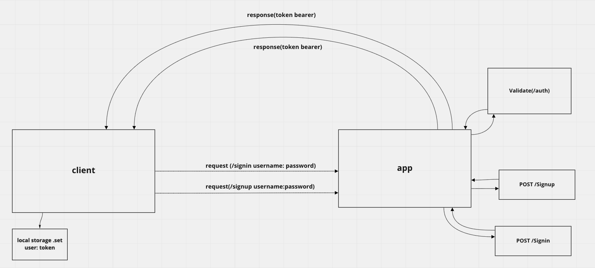

# bearer-auth
Created the backend of an application with a server with basic authentication. After a user is deemed "authenticated", the auth-server will generate a JWT signed "Token" which is returned to the application.

## Author 
Nick Abramowicz

## Deployed Heroku
https://bearer-auth-nick.herokuapp.com/

## Github Pull Request(s)
https://github.com/nickdeans/bearer-auth/pull/2

## UML
